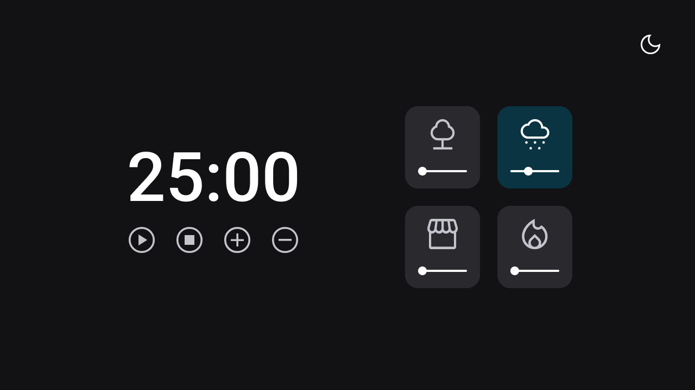
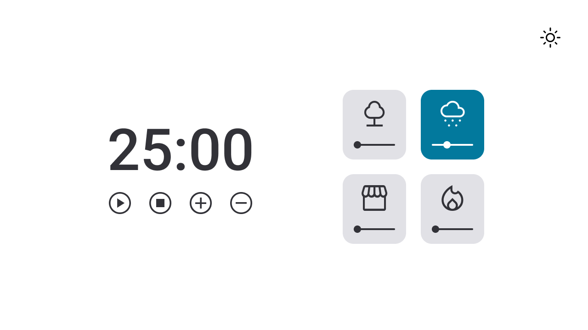

# Focus Timer 2.0
Temporizador estilo pomodoro feito pro curso Explorer da Rocketseat.  
Projeto feito pra praticar modularização, sons e alterar entre modo escuro e modo claro pelo JavaScript.

## Tecnologias
- HTML  
- CSS  
- JS  
- Git

## Layout
Veja o layout do projeto através [desse link](<https://www.figma.com/file/nkE26BE0yEKfZlTZB7lgyI/Stage-05---Dark-Mode-FocusTimer-(Copy)?node-id=0%3A1&mode=dev>).
 

  

 

  

